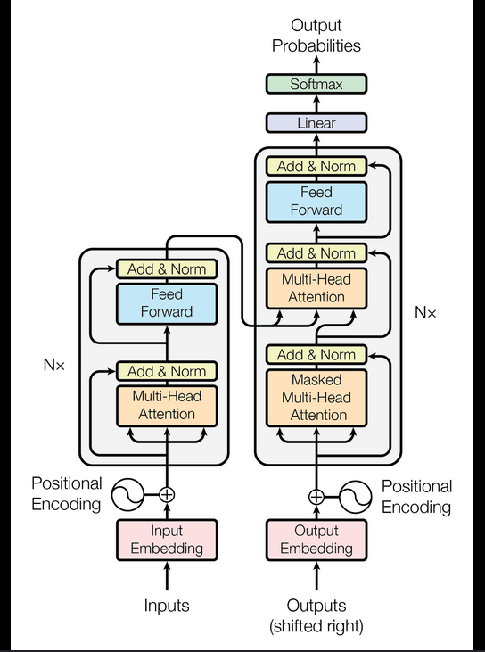
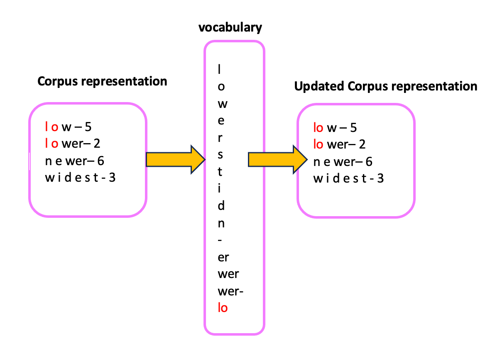

# NLP From Scratch

Welcome to **NLP From Scratch**! 🚀 This repository is my playground for diving deep into the inner workings of NLP models and tokenizers. 

## Folder Structure

### 1. Transformer Encoder

In this folder, you'll find a transformer model, specifically an encoder, that I've written from scratch using PyTorch. It's trained halfway (I didnt want to waste a lot of time training it, and its performance currently is half good, so I am happy with it) on masked language modeling, and when I say "from scratch," I mean **literally everything**. No shortcuts, no pre-built libraries—just pure, unadulterated pytorch code. Here's a peek into what you'll find:

- **Custom PyTorch Modules**: Every layer and operation is handcrafted.
- **Training Scripts**: Code to train the model on masked language tasks. (The training was done on Kaggle, and it was thus easier to copy the code instead of uploading and importing it)

The default parameters closely resemble those of Distilbert, but this model is smaller, with only 6 transformer block layers and 8 attention heads.

  

### 2. Tokenizer

This folder contains a tokenizer written in Go. It currently supports the BPE (Byte Pair Encoding) algorithm, and I'm planning to add support for the WordPiece algorithm soon. Why Go? Because it's fun and efficient! (I really like Golang, such a good language) In this folder, you can explore:

- **BPE Training**: Code to train the tokenizer on your dataset.
- **Tokenization**: Scripts to tokenize your text using the trained tokenizer.

#### How to Run the Tokenizer

1. Build the tokenizer: `go build -o tokenizer`
2. Train the tokenizer: `./tokenizer train corpus.txt compression`
3. Tokenize text: `./tokenizer tokenize input.txt`

- Compression refers to the maximum number of BPE merge rules to reach. (Could have opted for the number of tokens, but that changes from text to text).

  

## Key Learnings

This project has been a fantastic journey into the core of NLP. Here are some key takeaways:

- **Understanding Transformers**: By building a transformer from scratch, I've gained a deep appreciation for its architecture and the intricate dance of self-attention mechanisms.
- **Tokenization Techniques**: Implementing BPE in Go has opened my eyes to the world of efficient text processing and the importance of tokenization in NLP.
- **End-to-End Model Building**: From data preprocessing to model training, I've touched every part of the pipeline, solidifying my understanding of how these models come to life.

## Why This Project?

I've always been fascinated by the underlying structure of models. It's not just about using them but truly understanding how they work. This project is a testament to my love for dissecting complex systems and building them back up.